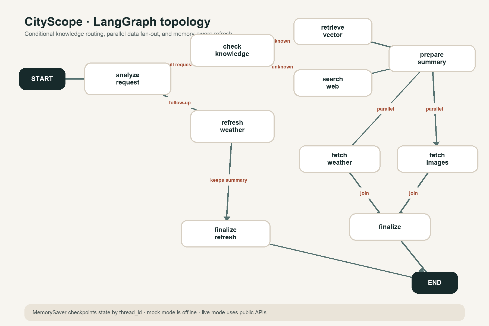

# CityScope: Multi-Modal Travel Assistant

CityScope is a runnable implementation of the AI Engineering assignment: a Streamlit travel assistant orchestrated by LangGraph. It decides whether a city is represented in a persistent local vector store or needs the web-search adapter, then fetches weather and images in parallel and returns a validated Pydantic object for the UI.

The default configuration is intentionally evaluator-friendly: it runs offline, needs no API key, and returns deterministic mock search, weather, and image data. A live mode is included for public Wikipedia, Open-Meteo, and Wikimedia endpoints. OpenAI is explicitly opt-in and can improve city extraction and summary writing; the application remains functional without it.



## What is implemented

- A typed LangGraph `StateGraph` with named nodes, explicit edges, and conditional routing.
- A persistent Chroma vector store preloaded with detailed Paris, Tokyo, and New York documents.
- Local deterministic feature-hashing embeddings, avoiding model downloads and embedding API keys.
- Retrieval-based routing: a city must match the retrieved document metadata and a cosine-distance threshold. There is no `if city in known_cities` route.
- A mock web-search adapter with selected city examples and an honest generic fallback.
- Key-free live adapters: Wikipedia summaries, Open-Meteo current weather and seven-day forecasts, and Wikimedia Commons images.
- Parallel LangGraph fan-out for weather and image retrieval, followed by a join before finalization.
- LangGraph `MemorySaver` checkpoints keyed by `thread_id`. A weather follow-up reuses the city and summary and runs only the weather refresh path.
- Pydantic validation for the final response and a Streamlit UI with summary, gallery, metrics, line chart, daily table, errors, and raw structured output.

## Architecture

The main request path is:

```text
START -> analyze_request -> check_knowledge
                              | known       | unknown
                              v             v
                       retrieve_vector   search_web
                              \             /
                               prepare_summary
                                  /       \
                       fetch_weather     fetch_images   (parallel)
                                  \       /
                                   finalize -> END
```

For a same-thread follow-up such as `What about the weather next week?`, `analyze_request` routes directly to `refresh_weather`, then rebuilds the structured response using the checkpointed city, summary, source, and image URLs.

Key modules:

| Path | Responsibility |
| --- | --- |
| `src/travel_assistant/graph.py` | Nodes, conditional edges, parallel fan-out, join, checkpointer |
| `src/travel_assistant/state.py` | Typed shared graph state and parallel warning reducer |
| `src/travel_assistant/vector_store.py` | Chroma persistence, local embeddings, retrieval threshold |
| `src/travel_assistant/tools.py` | Mock/live search, weather, and image adapters |
| `src/travel_assistant/llm.py` | Deterministic parsing plus optional OpenAI extraction/summarization |
| `src/travel_assistant/schemas.py` | Validated output models |
| `app.py` | Streamlit presentation and session/thread handling |

## Run locally

Prerequisites: Python 3.11 or 3.12 and `pip`. No external service or API key is required for the default mode.

```bash
git clone <repository-url>
cd <repository-directory>
python3.11 -m venv .venv
source .venv/bin/activate
python -m pip install --upgrade pip
python -m pip install -e '.[dev]'
cp .env.example .env
python scripts/init_vector_store.py
streamlit run app.py
```

Open `http://localhost:8501`. Try `Tell me about Tokyo` for the vector-store route and `Tell me about Kyoto` for the web-search route. Then ask `What about the weather next week?` without starting a new trip to exercise checkpointed state.

The explicit vector initialization step is useful for confirming setup, but optional: the application seeds the collection automatically on first start.

### Make shortcuts

```bash
make install
make init
make test
make run
```

### Docker

```bash
docker build -t cityscope .
docker run --rm -p 8501:8501 cityscope
```

Then open `http://localhost:8501`.

## Configuration

Copy `.env.example` to `.env`. Supported values:

| Variable | Default | Purpose |
| --- | --- | --- |
| `DATA_MODE` | `mock` | `mock` is key-free/offline; `live` uses public HTTP APIs |
| `MOCK_LATENCY_SECONDS` | `0.10` | Simulated latency per mock tool call |
| `API_TIMEOUT_SECONDS` | `10` | Timeout for each live HTTP request |
| `USE_LLM` | `false` | Must be `true` before the application calls OpenAI |
| `OPENAI_API_KEY` | unset | Enables LLM city extraction and grounded summary rewriting |
| `OPENAI_MODEL` | `gpt-4o-mini` | OpenAI model used when a key is present |
| `VECTOR_DB_PATH` | `.travel_data/chroma` | Override for the persistent Chroma directory |

Live mode uses internet access but no provider keys:

```bash
DATA_MODE=live streamlit run app.py
```

To enable the optional model path, set both `USE_LLM=true` and `OPENAI_API_KEY`. OpenAI failures fall back to deterministic parsing or the retrieved context instead of breaking the UI.

If a live weather or image request fails, the graph records a warning and falls back to mock data so the UI still renders. A failed live city summary is surfaced as an application error because silently substituting a fabricated destination description would be misleading.

## Structured output

The final graph node builds a `TravelResponse`. It includes the three required fields and small UI/debugging additions:

```json
{
  "city_summary": "...",
  "weather_forecast": [
    {
      "date": "2026-08-20",
      "temperature_min_c": 18.0,
      "temperature_max_c": 25.0,
      "condition": "Partly cloudy"
    }
  ],
  "image_urls": ["https://..."],
  "city": "Tokyo",
  "source": "vector_store",
  "current_weather": {
    "temperature_c": 24.0,
    "condition": "Clear",
    "humidity_percent": 61
  },
  "warnings": []
}
```

The forecast schema enforces five to seven points, URL values are validated, and humidity is range-checked.

## Tests and quality checks

```bash
pytest -q
ruff check .
python scripts/render_graph.py
```

Tests cover known/unknown vector routing, tool schemas, required forecast length, complete graph output, and memory-aware follow-up behavior. `graph.png` is generated by `scripts/render_graph.py`; rerun it after changing the topology.

## Adding internal city knowledge

1. Add a UTF-8 Markdown file to `data/cities/`, using the city name as the filename (for example, `san_francisco.md`).
2. Write concrete, factual material and include the canonical city name in the text.
3. Run `python scripts/init_vector_store.py`. The initializer detects the changed file set and rebuilds the collection.
4. Add a routing assertion to `tests/test_vector_store.py`.

This repository stores one detailed document per city because the assignment dataset is deliberately small. For a larger corpus, chunk the documents and retain a canonical `city_id` in each chunk's metadata before changing the threshold.

## Deliberate scope

- Mock data is not presented as real-time data; the sidebar shows the active mode.
- The local embedding is suitable for a three-city routing demonstration, not a multilingual or large-corpus production search system.
- `MemorySaver` is process-local. A deployed multi-instance service should use a durable LangGraph checkpointer.
- The implementation attempts the parallel fan-out and memory distinctions. It does not add a manual raw LLM tool-call protocol because the deterministic typed tool nodes are easier to run and the assignment marks that feature as optional.
